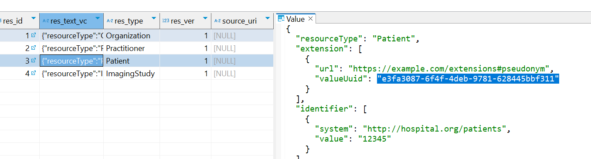

# Documentation HAPI FHIR JPA Server

## Introduction
The purpose of this HAPI FHIR JPA Server is to provide a Proof of Concept where
it functions like a metadata register. It is part of the [GFModules project](https://github.com/minvws/gfmodules-coordination) which is currently under development.
The information in this repository is subject to change. The GFModules project is a collection of applications that
have the purpose to improve the data exchange between healthcare providers. [HAPI FHIR](https://hapifhir.io/) is a complete implementation 
of the [HL7 FHIR](https://www.hl7.org/fhir/) standard for healthcare interoperability in Java. It is an open 
source software licensed under the business-friendly [Apache Software License 2.0](https://www.apache.org/licenses/LICENSE-2.0).


### JPA server
The HAPI FHIR JPA server offers a complete RESTful FHIR server implementation using JPA 2.0 for database persistence. This project is build up from a [starter repository](https://github.com/hapifhir/hapi-fhir-jpaserver-starter) to deploy an FHIR server, the full source can be found [here](https://github.com/hapifhir/hapi-fhir).
In the extensive [DOCS](https://hapifhir.io/hapi-fhir/docs/getting_started/introduction.html) much is explained about the JPA server, how it works and how it can be extended for particular use-cases. The project does not provide any security or enterprise audit logging.

**[HAPI JPA Server](https://hapifhir.io/hapi-fhir/docs/server_jpa/architecture.html) has the following components:** 
- **[Resource Providers](https://hapifhir.io/hapi-fhir/docs/server_plain/resource_providers.html):** A RESTful server Resource Provider is provided for each resource type in a given release of FHIR. Each resource provider implements all the FHIR methods, such as Search, Read, Create, Delete, etc.
- **[HAPI DAOs](https://hapifhir.io/hapi-fhir/apidocs/hapi-fhir-storage/ca/uhn/fhir/jpa/api/dao/IFhirResourceDao.html):** The Data Access Objects (_DAO_) implement all the database business logic relating to the storage, indexing, and retrieval of FHIR resources, using the underlying JPA API.
- **[Database](https://hapifhir.io/hapi-fhir/docs/server_jpa/database_support.html):** The RESTful server uses an embedded database but can be configured to communicate with any database supported by [Hibernate](https://hibernate.org/orm/). The JPA Server maintains active support for several databases such as: [MS SQL Server](https://www.microsoft.com/en-us/sql-server/sql-server-downloads), [PostgreSQL](https://www.postgresql.org/), [ORACLE](https://www.oracle.com/database/).
- **[Interceptors](https://hapifhir.io/hapi-fhir/docs/interceptors/interceptors.html):** Interceptor classes may "hook into" various points in the processing chain in both the client and the server. The interceptor framework has been designed to be flexible enough to hook into almost every part of the library. When trying to figure out "how would I make HAPI FHIR do X", the answer is very often to create an interceptor.
- **[Server Security](https://hapifhir.io/hapi-fhir/docs/security/introduction.html):** Every system and architecture operates in a different set of rules, and has different security requirements. As such, HAPI FHIR does not provide a single one-size-fits-all security layer. Instead, it provides a number of useful tools and building blocks that can be built around as a part of your overall security architecture.

### Basic FHIR model Hints
**[Extensions:](https://hapifhir.io/hapi-fhir/docs/model/profiles_and_extensions.html)** are a [FHIR standarized](https://www.hl7.org/fhir/extensibility.html) way of adding addional information to a resource. Extensions do not necessarily point to other resources but only act as an extra information holder.
```
{
  "extension": [
    {
      "url": "http://someserver/some-path",
      "valueCode": "I"
    }
  ],
  "text": "Chief Red Cloud"
}
```
**[Resource references](https://hapifhir.io/hapi-fhir/docs/model/working_with_resources.html)** are a [FHIR standard](https://www.hl7.org/fhir/references.html) to reference to a different resource. I.e. an ImagingStudy can have a resource reference to a Practioner, an Organization, Patient. This way the resources are linked with each other.
```
 "subject": {
   "reference" : "http://someserver/some-path",
   "type" : "Patient"
 }
```

## JPA Server setup as Metadata register
This set-up is only created for Linux, however, Windows would work as well.
To get started:
1. Clone or fork the JPA server starter GitHub repository: https://github.com/minvws/hapi-fhir-jpaserver-starter
2. Install a JDK: Minimum JDK17 or newer. A good [OpenJDK](https://openjdk.org/) is Azul Zulu: https://www.azul.com/downloads/?package=jdk#zulu
3. If your editor has no Maven support, install Maven with the following link: https://maven.apache.org/download.cgi
4. Install Docker: https://docs.docker.com/engine/install/
5. To start a PostgreSQL database container run: \
   `docker compose up -d`
6. start the basic JPA server by running: \
   `mvn spring-boot:run`
7. When the JPA server is up and running view the endpoint documentation at: http://localhost:8080/fhir


_To test the HAPI with the [Timeline](https://github.com/minvws/nl-irealisatie-zmodules-pgo-demo) service,
add at least an ImagingStudy to the HAPI fhir database._

**To easily set up sample FHIR entries use the following steps:**
1. Run JPA server
2. Open new terminal in project directory
3. Run the following command to get a bundle with sample data loaded in:

```curl
   curl -X POST http://localhost:8080/fhir \
   -H "Content-Type: application/json" \
   --data @fhir_examples/bundle.json
```

4. Test whether the HAPI has successfully gotten the data:

```curl 
curl -X GET http://localhost:8080/fhir/Patient/3
```

5. It should return something like:
```json
{
   "resourceType": "Patient",
   "id": "3",
   "meta": {
      "versionId": "1",
      "lastUpdated": "2024-09-06T09:41:59.937+02:00",
      "source": "#GdSt18FL7qntkzYu"
   },
   "identifier": [ {
      "system": "http://hospital.org/patients",
      "value": "12345"
   } ],
   "name": [ {
      "use": "official",
      "family": "Doe",
      "given": [ "John" ]
   } ],
   "gender": "male",
   "birthDate": "1980-01-01"
}
```

Before you request the timeline service ensure your endpoint is registered in the [address](https://github.com/minvws/nl-irealisatie-zmodules-addressing-register) and
the [pseudonym-exchange-service](https://github.com/minvws/nl-irealisatie-zmodules-pseudonym-service) knows your provider-id.
To find your provider-id, look in the [settings file](src/main/resources/application.yaml).

In the address DB you should have a entry that sets the address endpoint to: http://host.docker.internal:8080/fhir
and to set up the provider in the pseudonym service with the following steps:
1. do the following curl request in the terminal
```curl
curl -X 'POST' \
  'http://localhost:8504/register' \
  -H 'accept: application/json' \
  -H 'Content-Type: application/json' \
  -d '{
  "provider_id": "MY_HAPI",
  "bsn_hash": "2b826afa1c71f571a007dad61ce9fb9b63a24a328aa4ac009484a198ff565c51"
}'
```
2. Copy generated pseudonym, it would look like the following:
```{"pseudonym":"79693551-2195-464f-9e8f-b5a7b90ec854"}```
3. Open database editor to the `hapi` database
4. Go to table `hfj_res_ver`
5. Edit the extension in the `patient` resource entry

6. Replace the patient's extensions UUID with the copied pseudonym

Finally test whether the pseudonym service and the right pseudonym are all setup correctly:
1. Do curl request, this same pseudonym is used by the timeline service as a sample pseudonym and it is coupled to the same bsn_hash that was used with setting the provider ID:
```curl
curl 'http://localhost:8080/fhir/ImagingStudy/_search?pseudonym=677b33c7-30e0-4fe1-a740-87fd73c4dfaf'
```
If you do not get any imaging studies back in the response then the HAPI is not set up correctly. 

2. If you do get imaging studies back then try if [timeline service](http://localhost:8500/) works as well

### Setting properties
In the [application.yaml](src/main/resources/application.yaml) file, you can configure most server and HAPI settings, enable or disable components, and set custom resource providers and interceptors.  
The endpoint of the Pseudonym service and the target provider ID are both defined in this file as well.

**Custom Resource Providers:**
- **[PatientResourceProvider](src/main/java/ca/uhn/fhir/jpa/starter/ResourceProvider/PatientResourceProvider.java)**: Adds an extension with a pseudonym at a create Patient request.
- **[BundlePlainProvider](src/main/java/ca/uhn/fhir/jpa/starter/ResourceProvider/BundlePlainProvider.java)**: Adds extension to Patient when patient is added through a bundle upload.
- **[ImagingStudyResourceProvider](src/main/java/ca/uhn/fhir/jpa/starter/ResourceProvider/ImagingStudyResourceProvider.java)**: Modifies the search method to handle pseudonyms, which are processed through a pseudonym exchange service to match patients and retrieve related imaging studies.

**Custom Interceptor**
- [RemovePatientExtensionsInterceptor](src/main/java/ca/uhn/fhir/jpa/starter/Interceptors/RemovePatientExtensionsInterceptor.java): Removes the pseudonym extension from Patients before giving a response. This is important since the pseudonym should only be used internally.


## TODO's
- [ ] Instead of an Interceptor an separate database can be used to store the patient id with pseudonym to ensure the pseudonym is never shown in any response, but it can still be used to query for patients.
- [ ] Add parts...
- [ ] Optimize code